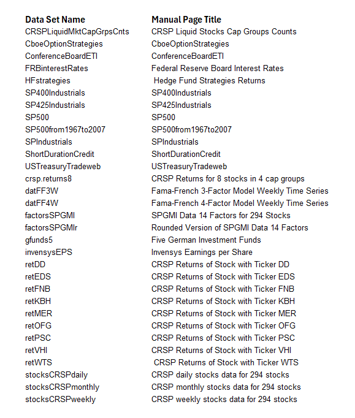
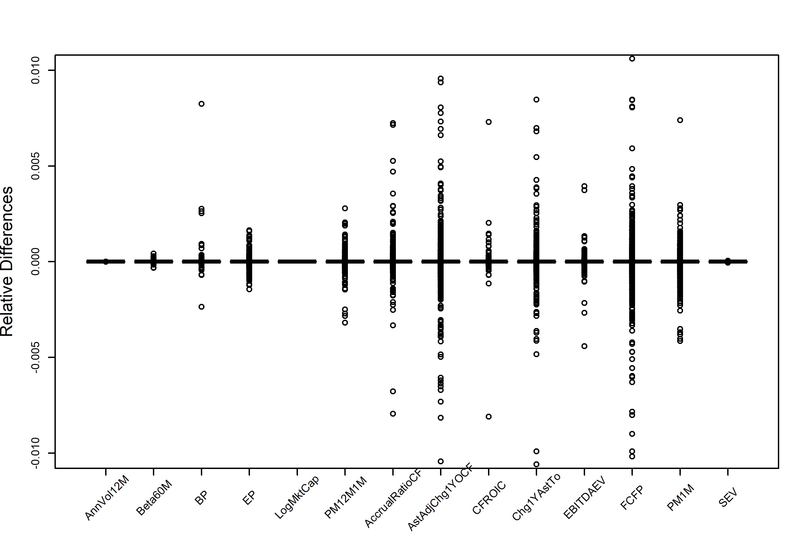

```{=html}
<div class="margin-toc-page">
```


::: {.copyright-notice}
**Authors:** Doug Martin, Tom Philips, Jon Spinney, and Kirk Li
:::

::: {.pdf-callout}
::: {.pdf-icon}
&#128196;
:::
::: {.pdf-text}
**Download vignette**
[Vignette 1 — RPCRA Package and Data Overview](pdfs/vignette-1.pdf){target="_blank"}
:::
:::

# The PCRA Package

This vignette is intended primarily as an overview of the structure and contents of the `PCRA`package (other vignettes and help material will go into greater depth on the actual functionality and use of`PCRA`and its related packages), and assumes that you have already installed R version 4.4.3 or later, as well as a current version of RStudio, on your computer, or will do so before reading the following material. To find out how to install R and RStudio, we recommend reading the appropriate parts of Appendix A in *Hands on Programming with R* , available online at <https://rstudio-education.github.io/hopr/> .

The`PCRA`package was created to provide data-oriented computational support for the book *Robust Portfolio Construction and Risk Analysis* (RPCRA), co-authored by Doug Martin, Thomas Philips, Bernd Scherer and Kirk Li. The book’s publication by Springer is planned for 2026.

An important feature of the PCRA book is its emphasis on *reproducibility* , whereby many of its figures and tables are reproducible with R code that is downloadable from a`demo`folder in the`PCRA`package. Such reproducibility is made possible by the inclusion of many (but not all) the data sets used by the R code that reproduces the figures and tables. Currently the PCRA package contains thirty-one data sets, the most frequently used of which are CRSP® stocks data, Standard and Poor’s Global Market Intelligence (SPGMI) factors data, S&P Dow Jones indices including the S&P 500 ® , S&P Industrials ® , S&P 400 Industrials ® , and the S&P 425 Industrials ® , as well as data sets from the Chicago Board of Options Exchange LiveVol, Conference Board, Intercontinental Exchange (ICE) and Tradeweb Markets LLC.

These data sets may be used in conjunction with factor model fitting, portfolio optimization, and portfolio performance analysis methods in`PCRA`and other R packages to conduct realistic quantitative equity portfolio construction and performance analyses. These other packages include, but are not limited to, the time-series factor models package`facmodTS`, the cross-section factor models package`facmodCS`, the portfolio performance analysis package`PerformanceAnalytics`, and the portfolio optimization package`PortfolioAnalytics`, all of which are available at CRAN ( <https://cran.r-project.org> ).

It is important to keep in mind that there currently exist two versions of the PCRA package:

- `PCRA-1.3`(the production version), which is available on CRAN at <https://cran.r-project.org/web/packages/PCRA>

- `PCRA-1.3.1`(the development version), which is available at <https://github.com/robustport/PCRA> .

Before reading the rest of this document, you should install the CRAN version of`PCRA`using RStudio’s`Tools > Install Packages`menu, entering`PCRA`in the “ Packages ” field, and clicking “ Install ” . After the installation is finished, load the package using R’s`library`function, ignoring any warning messages that might appear.```{r echo=true, warning=false}
library(PCRA)
```Both PCRA versions have identical functionality except for new features and data sets in the development version, and differences in their CRSP® stocks and SPGMI factors data. Specifically, due to data storage space constraints, the`PCRA-1.3`package hosted on CRAN contains CRSP® stocks data only at a monthly frequency and slightly rounded SPGMI factors in the data sets

- ` stocksCRSPmonthly`- `factorsSPGMIr.`For details of the above two data sets, use the use the R`help`function:```{r echo=true, warning=false, eval=false}
help(stocksCRSPmonthly) help(factorsSPGMIr)
```The`PCRA-1.3.1`development version contains daily and weekly CRSP® stocks data and unrounded SPGMI factors data in addition to the monthly CRSP® stocks data and rounded SPGMI factors data contained in`PCRA-1.3`. The additional data sets are:

- ` stocksCRSPweekly`- `stocksCRSPdaily`- `factorsSPGMI.`Section provides details concerning the rounding used to create the`factorsSPGMIr`data from the`factorsSPGMI`data, and shows that there are only minor differences on the order of 1% (and typically much less than 1%) in`factorsSPGMIr`data values relative to their`factorsSPGMI`counterparts. This suggest that one will see minimal differences in portfolio performance when using`factorsSPGMIr`in place of`factorsSPGMI`. None the less, users of the`PCRA-1.3`package who prefer to use the unrounded`factorsSPGMI`data can do so in a manner described in the document “ CRSP Stocks and SPGMI Factors in PCRA ” , which is downloadable from CRAN at <https://cran.r-project.org/web/packages/PCRA> , or can switch to the development version.

The R code chunks used for creating this vignette are provided in the`PCRA Overview Demo.R`script in the`demo`folder of the`PCRA`package. Instructions for accessing and running such scripts are provided in the vignette “ PCRA Reproducibility Code ” , which we recommend reading in conjunction with this vignette.

## Other Data in the PCRA Package

In addition to the relatively large CRSP® and SPGMI data sets, the`PCRA`package contains a large number of other data sets that are used throughout various chapters of the RPCRA book, and which may be used for a wide variety of computing exercises, *though strictly for academic (i.e. non-commercial) purposes* . The following use of the R`data`function results in the Figure display of the data set names as well as their corresponding brief descriptions :```{r echo=true, warning=false, eval=false}
data(package = "PCRA")
```Detailed descriptions of each of the`PCRA`data sets can be obtained using R’s`help`function, e.g., to see the details of the SP500 index data, type:```{r echo=true, warning=false, eval=false}
help(SP500)
```

### The S&P Datasets

Standard and Poor’s has graciously consented to the inclusion of five datasets in the`PCRA`package, one of which (`SP500`) is updated annually as new year-end data on the S&P 500 ® Index becomes available. The other four datasets are historical and are copied from paper copies of the S&P Analysts’ Handbook. All five data sets are of type`data.frame`.

It is instructive to compare`SP500`with`SP500from1967to2007`,`SPIndustrials`,`SP400Industrials`and`SP425Industrials`. The first is updated once a year, and a superset of the data that is added to it each year can be viewed at <https://www.spglobal.com/spdji/en/documents/additional-material/sp-500-eps-est.xlsx> . The latter four data sets are, in contrast, derived from scans of old paper copies of the S&P Analysts’ Handbook. Some columns that were provided in the past (e.g.`Cash_Flow`,`Depreciation`and`TotalReturnIndex`) are no longer provided, while other columns that were not provided in the past (e.g.`SP500CapEx`) are now provided.

### The CBOE Dataset

The PCRA data set`CboeOptionStrategies`is a`data.frame`with total return indices for ten options-related strategies as well as price and total return indices for the S&P 500 ® Index, the yield on 3-month T-bills and two equity volatility indices (VIX and VXO) from June 1986 to December 2021. Information on these ten strategies, as well as many others, can be found at <https://www.cboe.com/us/indices/indicessearch/> .

### The Conference Board Dataset

### The ICE Dataset

The PCRA data set`ShortDurationCredit`is a`data.frame` with the monthly total return, Yield to Maturity, Weighted Average Maturity, Modified Duration and Option-Adjusted Spread of the ICE BofA 1-3 Year AAA-A US Corporate Index (Index C110) and the ICE BofA 1-3 Year US Treasury Index (Index G1O2).

### The Tradeweb Dataset

The PCRA data set`USTreasuryTradeweb`is a`data.frame` with the daily bid and ask prices and yields of the On-the-run and First Off-the-run 1-Year, 2-Year, 5-Year, 10-Year and 30-Year U.S. Treasury Notes (or Bonds) from January 2, 2008 to December 30, 2021.

# CRAN PCRA Basics

Here we focus on a few basic aspects of the`stocksCRSPmonthly`and the`factorsSPGMIr`data sets in the CRAN version of`PCRA`, and defer more detailed discussion to the vignette “ CRSP Stocks and SPGMI Factors in PCRA ” . The`PCRA`package contains many R functions and datasets, a list of which can be viewed by typing`ls`in the RStudio Console:```{r echo=true, warning=false, eval=false}
library(PCRA) ls("package:PCRA")
```The data sets`stocksCRSPmonthly`data, and the`factorsSPGMIr`are`data.table`type objects, and in order to view and manipulate them you need to install and load the`data.table`R package. Install the current version of`data.table`in RStudio the same way you installed the PCRA package. Then load`data.table`by typing`library(data.table)`, and confirm that`stocksCRSPmonthly`and`factorsSPGMIr`are indeed`data.table`objects by typing:```{r echo=true, warning=false}
library(data.table) class(stocksCRSPmonthly) class(factorsSPGMIr)
```PCRA uses`data.table`types for the`stocksCRSPmonthly`and`factorsSPGMIr`data sets for two reasons:

1.  The`data.table`package has powerful data manipulation tools that do not exist for`data.frame`objects, and

2.  The`data.table`package can handle large data sets without its performance becoming degraded.

Note that a`data.table`object is indeed a “ table object ” whose dimensions and column names can be obtained by typing:```{r echo=true, warning=false}
dim(stocksCRSPmonthly) # Number of rows and columns names(stocksCRSPmonthly) # Names of data items in each column
```You can discover the structure of`stocksCRSPmonthly`by displaying the first and last five rows of its first, second and ninth columns by typing:```{r echo=true, warning=falseALSE}
stocksCRSPmonthly[, c(1:2, 9)]
```The results displayed above indicate that the row structure of`stocksCRSPmonthly`consists of blocks of size 294, one block for each of the months from 1993 through 2015. That time period consists of 24 years (or 276 months), and since the block for each month consists of 294 stocks, the total number of rows of`stocksCRSPmonthly`is , as was seen by the use of`dim(stocksCRSPmonthly`).

Similarly, you can see the dimensions and column names of`factorsSPGMIr`with:```{r echo=true, warning=false}
dim(factorsSPGMIr) # Number of rows and columns names(factorsSPGMIr) # Names of data items in each column
```## Data Table Objects Versus Data Frame Objects

You may have wondered why`class(stocksCRSPmonthly)`and`class(factorsSPGMIr)`return both “ data.table ” and “ data.frame ” , the first of which is indeed the class of each these two data sets. The occurrence of “ data.frame ” after “ data.table ” indicates that the`data.table`object *inherits* all the properties of a`data.frame`object, and adds to these a number of features to enhance both its syntax and its performance. In view of the above property of a`data.table`object, it should not be surprising that you can easily convert a`data.table`object to a`data.frame`by applying the`data.frame`function to it:```{r echo=true,warning=false}
dat.df <- data.frame(stocksCRSPmonthly) class(dat.df) names(dat.df)
```Users who are familiar with manipulating`data.frame`objects will find the above conversion method handy.

## The Rounded SPGMI Factors Data

The rounded data in`factorsSPGMIr`was obtained by rounding the data in`factorsSPGMI`to 4 significant digits, and then compressing it with level 9 “ xz ” compression. The results of these steps are displayed in Table . The compression reduces the 6.452 MB`factorsSPGMI`data set by 72.3% to about 1.787 MB for`factorsSPGMIr`. This overall data compression process was required so that the`PCRA`package, which also contains the 1MB sized`stocksCRSPmonthly`data and other miscellaneous data sets totaling about 2MB in size satisfies CRAN’s maximum package data size of 5MB.

Rounding factors data to four significant digits turns out to make little difference in the precision of the`factorsSPGMIr`data relative to the`factorsSPGMI`. This claim is supported by Figure , which shows that the fractional error in all the factors is always less than about (it is less than for four of the fourteen factors). We expect these minor differences in`factorsSPGMIr`relative to`factorsSPGMI`to have a negligible impact on factor model fits.```{r echo = FALSE, results = FALSE, warning=false}
#### Compute factorsSPGMIr differences relative to factorsSPGMI library(PCRA) data(factorsSPGMI) # A data.table object data(factorsSPGMIr) # A data.table object factorsSPGMI <- data.frame(factorsSPGMI)[ , -c(1:8)] factorsSPGMIr <- data.frame(factorsSPGMIr)[ , -c(1:8)] # dim(factorsSPGMI) # names(factorsSPGMI) relative_difference <- function(v1, v2) { return((v2 - v1) / v1) } relDiff <- data.frame(matrix(rep(0,81144*14), ncol = 14)) for (i in 1:14){ relDiff[,i] <- relative_difference(factorsSPGMI[, i], factorsSPGMIr[, i]) } names(relDiff) <- names(factorsSPGMI) png(file = "Plots/factorsRelativeDiff.png", width = 6, height = 4, units = "in", pointsize = 6, res = 600) bp <- boxplot(relDiff,xlab = NULL, ylab = "Relative Differences", ylim = c(-0.01, +0.01), xaxt = "n", cex.lab = 1.5) tick <- seq_along(bp$names) axis(1, at = tick, labels = FALSE) text(tick, par("usr")[3] - 0.0015, bp$names, srt = 45, xpd = TRUE) dev.off()
```

As is explained in the vignette “ Introduction to CRSP Stocks and SPGMI Factors in PCRA ” , users of the CRAN`PCRA-1.3`package actually have access to the non-rounded`factorsSPGMI`data in a special`DataPlus`folder of the`PCRA`github repository at <https://github.com/robustport/PCRA> . Our recommendation to users of the CRAN version of PCRA is to first fit factor models using`factorsSPGMIr`, and then, if there is any concern about the adverse impact of rounding, to check the model fit by refitting it using`factorsSPGMI`.

## PCRA Data Sets are NOT Open Source!

While the`PCRA`package contains a number of open source R functions and scripts, the`stocksCRSPmonthly`,`stocksCRSPweekly`,`stocksCRSPdaily,` `factorsSPGMIr`,`factorsSPGMI,` `SP500`,`SP500from1967to2007`,`SPIndustrials`,`SP400Industrials, SP425Industrials, CboeOptionStrategies, ConferenceBoardETI,` `ShortDurationCredit`and`USTreasuryTradeweb`datasets supplied with it *are not open source* , and *may not be redistributed in any way or form or used for any commercial (i.e. non-educational) purpose* . The authors wish to express their gratitude to CRSP® , SPGMI, S&P Dow Jones Indices, CBOE LiveVol LLC, ICE Data Indices LLC and Tradeweb Markets LLC for allowing us to provide these data sets in the PCRA package. Their generosity will greatly enhance students’ understanding of portfolio construction and risk analysis methods through the use of these data sets in reproducing the examples and doing the various computational exercises provided in the book, as well as by solving problems assigned by their course instructors.

# Development Version of PCRA

The development version of`PCRA`(currently`PCRA-1.3.1`) can be installed from its github repository (repo) at <https://github.com/robustport/PCRA> . It contains new features that will be included in the next`PCRA`CRAN release (currently`PCRA`-1.4). Furthermore, an important convenience feature of`PCRA`development versions is that they contain all the CRSP® stocks data and SPGMI factors data sets, namely:

- ` stocksCRSPmonthly`- `stocksCRSPweekly`- `stocksCRSPdaily`- `factorsSPGMI`- `factorsSPGMIr`However, PCRA development version users will need only the`factorsSPGMIr`rounded data in case they want to confirm that its use in portfolio constructio n does not result in any significant differences between a portfolio’s performan ce based on`factorsSPGMIr`and its performance based on the`factorsSPGMI`.

In order to install the development version of`PCRA`one needs to have installed the R package`devtools`, which can be done in the RStudio console following the procedure used to install the`data.table`and`PCRA`packages. Once`devtools`has been installed, the development version of`PCRA`can be loaded and installed using the following commands in the RStudio console:```{r echo=true, warning=false, eval=false}
library(devtools) devtools::install_github("robustport/PCRA")
```The main advantages of the development version of`PCRA`are:

- It will contain new features that are not contained in the CRAN version of` PCRA`- It will contain all the CRSP® and SPGMI data sets

The primary disadvantage of using the`PCRA` development version is that some new features or data sets may not yet be fully tested or documented.


```{=html}
</div>

<script>
document.addEventListener("DOMContentLoaded", function () {
  const sidebar = document.querySelector("#quarto-margin-sidebar");
  const firstSection = document.querySelector("#quarto-document-content h2, #quarto-document-content h3");

  function alignMarginToc() {
    if (!sidebar || !firstSection) return;
    if (window.innerWidth <= 991) {
      sidebar.style.marginTop = "";
      return;
    }
    const offset = firstSection.getBoundingClientRect().top - sidebar.getBoundingClientRect().top;
    sidebar.style.marginTop = Math.max(0, Math.round(offset)) + "px";
  }

  alignMarginToc();
  window.addEventListener("resize", alignMarginToc);

  const toc = document.querySelector("#quarto-margin-sidebar #TOC, #TOC");
  if (!toc) return;

  const links = [...toc.querySelectorAll('a[href^="#"]')];
  const sections = links
    .map(function (link) { return document.querySelector(link.getAttribute("href")); })
    .filter(Boolean);
  if (!sections.length) return;

  const setActive = function (id) {
    links.forEach(function (link) {
      link.classList.toggle("active", link.getAttribute("href") === "#" + id);
    });
  };

  const observer = new IntersectionObserver(
    function (entries) {
      entries.forEach(function (entry) {
        if (entry.isIntersecting) setActive(entry.target.id);
      });
    },
    { rootMargin: "-15% 0px -65% 0px", threshold: 0 }
  );

  sections.forEach(function (section) { observer.observe(section); });
  if (sections[0]) setActive(sections[0].id);
});
</script>

```
