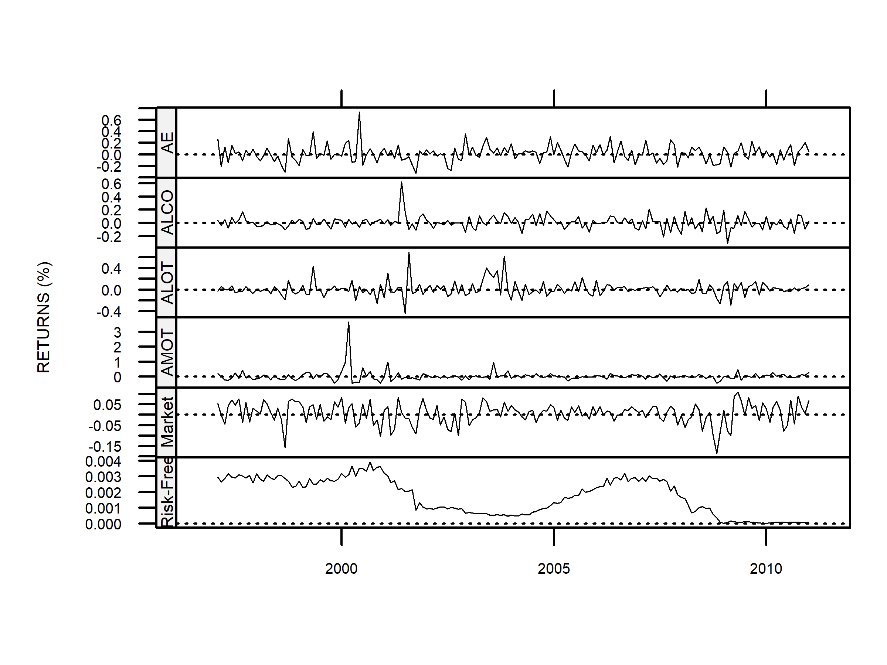
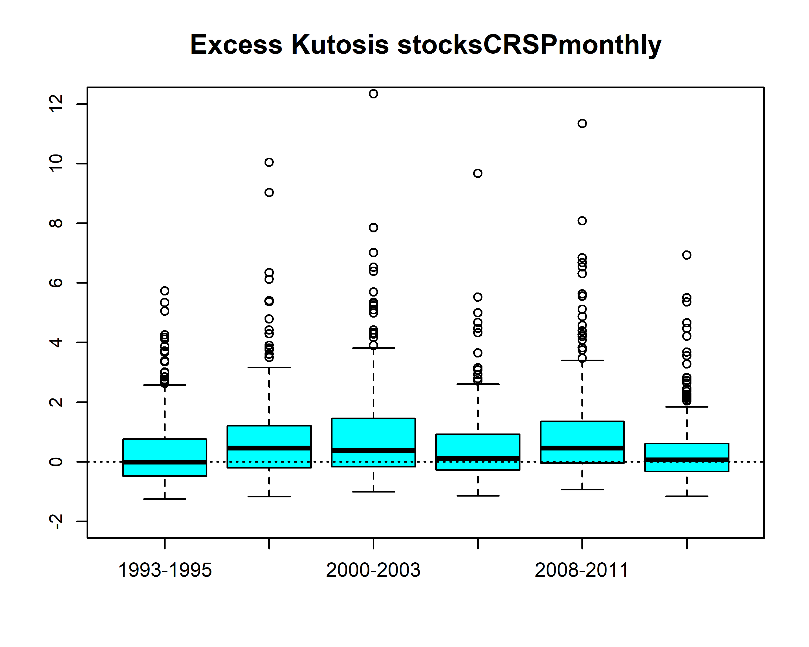
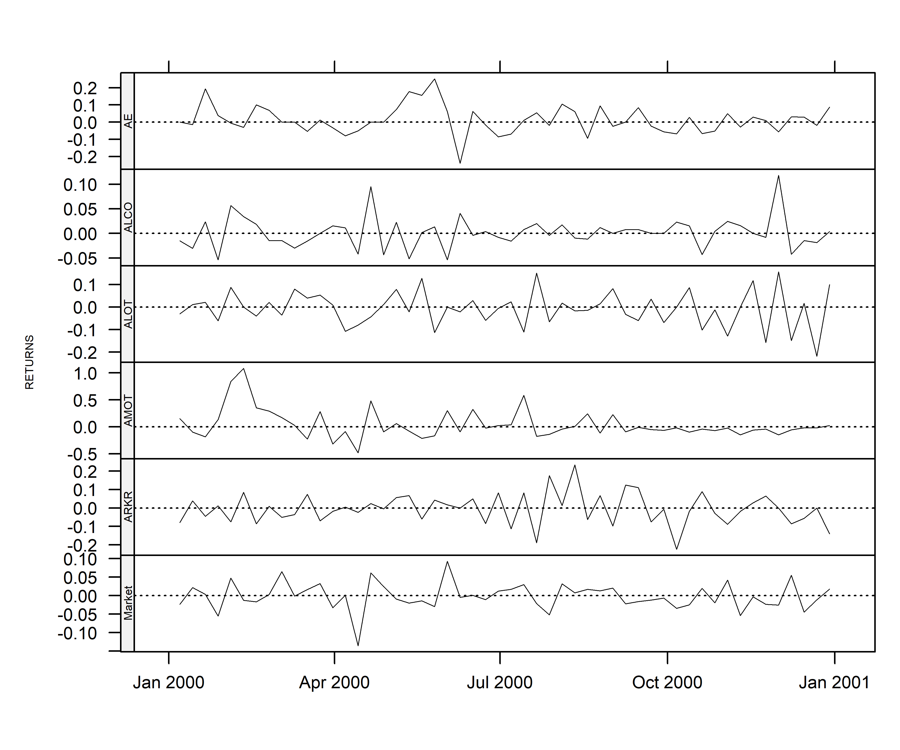

```{=html}
<div class="margin-toc-page">
```

::: {.copyright-notice}
**Authors:** Doug Martin and Jon Spinney
:::

::: {.pdf-callout}
::: {.pdf-icon}
&#128196;
:::
::: {.pdf-text}
**Download vignette**
[Vignette 2 — CRSP Stocks and SPGMI Factors in PCRA](pdfs/vignette-2.pdf){target="_blank"}
:::
:::

# Introduction {#sec-introduction}

The `PCRA` package, with its included CRSP® stocks data and SPGMI factors data, provides important computational support for the book *Robust Portfolio Construction and Risk Analysis* (RPCRA), co-authored by Doug Martin, Thomas Philips, Bernd Scherer and Kirk Li. CRSP® stands for the Center for Research in Security Prices, LLC, an Affiliate of the University of Chicago Booth School of Businsess, and SPGMI is an acronym for S&P Global Market Intelligence.

There are two versions of the PCRA package:

1.  The *production* CRAN version that is available at <https://CRAN.R-project.org/package=PCRA> and which is the focus of this document, and

2.  The *development version* located at <https://github.com/robustport/PCRA>.

This document focuses on two `data.table` objects in `PCRA`: `stocksCRSPmonthly` and `factorsSPGMIr`, as well as the function `selectCRSPandSPGMI` for extracting subsets of their data jointly or separately. When doing so, the user can specify the format of the extracted data – it can be returned either as a `data.table` or as an `xts` time series object.

The `stocksCRSPmonthly` data set consists of monthly CRSP® stock returns and descriptive data for 294 stocks from January 1993 to December 2015, while `factorsSPGMIr` contains 14 monthly factor exposures and related data for each of the stocks in `stocksCRSPmonthly`. The postscript `r` in `factorsSPGMIr` signifies that the factor data has been slightly rounded to decrease the size of the dataset – full precision data can be found in the development version of `PCRA`. Further details concerning `factorsSPGMIr` and `factorsSPGMI` are provided in the vignette “PCRA Package Overview” that is mentioned above.

Note that unlike the open source functions in the `PCRA` package, the CRSP® stocks and SPGMI factors data ***are not open source, and may not be redistributed in any form or used for any commercial (i.e. non-educational) purpose***.

The authors of the `PCRA` package wish to express their gratitude to CRSP® and SPGMI for allowing them to provide these data sets in the PCRA package. Their inclusion is of great educational benefit to students, who will more effectively learn portfolio construction and risk analysis methods through the use of these data sets in reproducing the examples in the PCRA book, as well as by doing computational exercises provided by their course instructors, both from this book and elsewhere.

The complete set of R code chunks in the remainder of this document is provided in the `CRSPandSPGMIdata.R` script in the `demo` folder of the `PCRA` package, and we recommend running the code in conjunction with reading this vignette.

`PCRA` makes extensive use of the `data.table` package. Our primary motivation for its extensive use in `PCRA`, as well as in the companion cross-section factor models package `facmodCS`, are:

1.  The enhanced performance of `data.table` objects for factor model fitting and portfolio optimization using large cross-sections of stock returns and factor exposures, and

2.  The ability of `data.table` objects to support portfolio optimization with a time-varying number of investable assets.

In order to access the CRSP® stocks and SPGMI factors data, one needs to install the `PCRA` package from CRAN, or the development version of `PCRA` located at <https://github.com/robustport>, depending on one’s preference or an instructor’s guidance. The CRAN version of `PCRA` can be installed in RStudio using the `Tools > Install Packages` menu item.

In order to install the development version of `PCRA` one needs to have installed the R packages `devtools` or `pak`, which can be done in the RStudio console following the procedure used to install the `data.table` and `PCRA` packages. Once `devtools` or `pak` has been installed (`pak` is a modern package installer, and has drop-in replacements for a number of `devtools` functions including `install_github()`, `install_git()`, `install_version()`, and `install_local()` among others), the development version of `PCRA` can be loaded and installed using the following commands in the RStudio console:

```r
# Traditional approach using devtools
library(devtools) 
devtools::install_github("robustport/PCRA")

# Modern approach using pak
# Install directly from GitHub, separate function not needed
pak::pkg_install("robustport/PCRA")
```

# The CRSP® Stocks and SPGMI Factors Data Sets {#sec-the-crsp-stocks-and-spgmi-factors-data-sets}

## The stocksCRSPmonthly Data Set {#sec-the-stocks-crsp-monthly-data-set}

Most of the contents of this section apply equally well to the weekly and daily CRSP® data.  After installing the `PCRA` and `data.table` packages, the following lines of code can be used to load and extract the class, dimension, and names of the `stocksCRSPmonthly` data:

```r

library(PCRA)
library(data.table)

class(stocksCRSPmonthly) 	# Class of stocksCRSPmonthly
dim(stocksCRSPmonthly)   	# Number of rows and columns
colnames(stocksCRSPmonthly) # Names of items in each column
```

The dimension values 81,144 and 14 are the number of rows and columns, respectively, in `stocksCRSPmonthly`. The number of rows is equal to the number of stocks (294) times the number of months (276) from January 1993 to December 2015, i.e. 294×276=81,144. The fourteen columns contain the fourteen data items (variables) whose names are displayed above.

The temporal structure of stocksCRSPmonthly is revealed by displaying the first and last five rows of its first four columns using a single line of code :

```r

stocksCRSPmonthly[ , 1:4]
```

It is apparent that the table consists of 276 blocks of length 294, where each block contains data for the 294 stocks for one of the 276 months between 1993 and 2015.

The ten `stocksCRSPmonthly` data items “Date”, “Ticker”, “TickerLast”, “Company”, “Return”, “RetExDiv”, “Price”, “PrcSplitAdj”, “Ret13WkBill”, and “MktIndexCRSP” are provided by CRSP®. The ticker of a company can change over time, and thus the “Ticker” column contains the tickers of the stocks in `stocksCRSPmonthly` as they originally appeared in that month. As a matter of convenience in some applications, and in order to have a single unique ticker for each stock, “TickerLast” contains the stock ticker of each company as of December, 2015. The “Company” item contains the names of the companies in December 2015.  #sec-names-of-crsp-items-in-stockscrspmonthly-data-set provides the mapping of all but the first of the above ten item names to the names used internally by CRSP®.

The “GICS” data is based the *Global Industry Classification Standard* six digit code developed by MSCI and Standard and Poor’s (S&P), the details of which are available at <https://en.wikipedia.org/wiki/Global_Industry_Classification_Standard>. The “Sector” item indicates which of a number of broad industry groups each Company belongs to, and the following line of code reveals that the stocks in `stocksCRSPmonthly` belong to one of eight sectors:

```r

unique(stocksCRSPmonthly[ , Sector])
```

The GICS classification has eleven sectors, consisting of the eight listed above as well as “Financials”, “Utilities” and “Real Estate”. It just so happened that in the process of selecting 294 stocks with relatively few missing factor exposures for use in both the `stocksCRSPmonthly` and `factorsSPGMI` data sets, we ended up with only eight of the eleven possible sectors.

The “CapGroup” data is the time-varying capitalization group of a company for each month from the beginning of 1993 until the end of 2015, and its values are one of the character strings “MicroCap”, “SmallCap”, “MidCap” or “LargeCap”. CapGroup can be useful when one wants to study the performance of a capitalization group portfolio, e.g., an equally-weighted or value-weighted portfolio consisting of all the SmallCap stocks in `stocksCRSPmonthly`. Again, for convenience, “CapGroupLast” is the market capitalization group of a company as of December, 2015. The methodology we use to compute the CapGroup breakpoints for each month is discussed in  @sec-crsp-stocks-market-capitalization-break-points.

Detailed descriptions of the data in the columns of `stocksCRSPmonthly` are provided in the “PCRA Reference Manual”, which is downloadable from the CRAN PCRA website ( <https://CRAN.R-project.org/package=PCRA> ), and you can view these descriptions using the R `help` function:

```r

help(stocksCRSPmonthly)
```

Readers are encouraged to familiarize themselves with the detailed descriptions of the data in the columns of `stocksCRSPmonthly`.

## The factorsSPGMIr Data Set {#sec-the-factors-spgmir-data-set}

Everything discussed in this section applies equally well to the unrounded SPGMI factors data set `factorsSPGMI`. It takes only three lines of code to display the class, dimension, and item names associated with `factorsSPGMIr` in the RStudio Console:

```r

class(factorsSPGMIr)
dim(factorsSPGMIr)
colnames(factorsSPGMIr)
```

Observe that the number of rows of the `factorsSPGMIr` table is the same as for the `stocksCRSPmonthly` table, but the number of columns is 22, not 14. The first 8 columns of `factorsSPGMIr` are identical to the first 8 columns of `stockSPGMI`, and its last 14 columns contain the 14 SPGMI factors, whose values are referred to as *factor exposures*. Detailed descriptions of each of the 14 factors are provided in the “PCRA Reference Manual”, which is downloadable from the PCRA CRAN website, and can be viewed in the RStudio `help` tab with:

```r

help(factorsSPGMIr)
```

We recommend that readers familiarize themselves with the detailed descriptions of the 14 factor exposures in `factorsSPGMIr`.

The following code line displays the first and last five rows of the first four columns of `factorsSPGMIr` and makes clear that it has the same table structure as `stocksCRSPmonthly` :

```r

factorsSPGMIr[ , c(1, 3, 10:13)]
```

Check that `factorsSPGMIr[c(1:3, 81142:81144), c(1, 2, 11, 12)]` results in the first and last three rows of the “Date”, “Ticker”, “BP”, and “EP” columns of `factorsSPGMIr` being printed and that `factorsSPGMIr[1, 17:22]` results in the last six rows of its first column being printed.

## Manipulating a data.table {#sec-manipulating-a-data-table}

The simple method of sub-setting the columns of a `data.table` with numeric column values is identical to the method applicable to `data.frames`. But sub-setting columns by their names is done differently for `data.table` and `data.frame` objects. We illustrate this by first converting the `stocksCRSPmonthly` to a `data.frame` object in preparation for comparing sub-setting by column names:

```r

dat.df <- data.frame(stocksCRSPmonthly)
class(dat.df)
colnames(dat.df)
```

Recall that you can subset a `data.frame` by using a character vector of the column names in quotes, and if you subset by two or more columns, the subset will also be a `data.frame`. But if you subset a single column, the result is (somewhat unexpectedly) a *vector* instead of a `data.frame`. We can force R to return a `data.frame` by using the `drop = FALSE` argument when sub-setting a single column as in the example below.

```r

dat.Return <- dat.df[ , "Return"]
class(dat.Return)

dat.Return <- dat.df[ , "Return", drop = FALSE]
class(dat.Return)

dat.DateAndReturn <- dat.df[ , c("Date","Return")]
class(dat.DateAndReturn)
```

In the case of a `data.table,` we can subset a single column, for example the “Return” column, by using its name without quotes, but the result is once again a vector (in this case a numeric vector) instead of a `data.table`. The way to return a `data.table` when sub-setting one or more columns of a `data.table` is to define the subset using a list of column names without quotes, e.g., `list(Return)` instead of `Return`. This is illustrated below, where it is also shown that `.( Return)` is shorthand for `list(Return)`, and that this shorthand also works when selecting two or more columns of a `data.table`.

```r

dat <- stocksCRSPmonthly # This is a data.table

dat.Return <- dat[ , Return]
class(dat.Return)

dat.Return <- dat[ , list(Return)]
class(dat.Return)

dat.Return <- dat[ , .(Return)]
class(dat.Return)

dat.DateAndReturn <- dat[ , .(Date, Return)]
class(dat.DateAndReturn)
```

There is much to learn about manipulating `data.table` objects, and the interested reader can begin to do so by reading the “Introduction to data.table” Vignette at <https://CRAN.R-project.org/package=data.table>.

Meanwhile, the code below illustrates simple uses of `data.table` sub-setting of a single column, which results in a `numeric` object, first to compute the number of rows of `stocksCRSPmonthly`, and then to determine first and last dates of `stocksCRSPmonthly.`

```r

nMonths <- length(unique(stocksCRSPmonthly[ , Date]))
nStocks <- length(unique(stocksCRSPmonthly[ , TickerLast]))

nMonths
nStocks
nMonths*nStocks # Number of rows
range(stocksCRSPmonthly[ , Date]) # First and last date
```

We suggest the reader create the data set `datBP` with `datBP <- factorsSPGMIr[ , .(Date, TickerLast, BP)]`, and, without looking at `datBP`, estimate its dimension. It is a simple matter to then confirm whether or not one’s estimate is correct.

# Selecting CRSP® Stocks and SPGMI Factors Data {#sec-selecting-crsp-stocks-and-spgmi-factors-data}

We next discuss use of the `selectCRSPandSPGMI` function to select individual or merged subsets of CRSP® stocks in `stocksCRSPmonthly` and SPGMI factors in `factorsSPGMIr`, returning either a `data.table` or a time series `xts` object. This capability will be particularly useful for creating cross-section factor model data sets for use in the cross-section factor models package `facmodCS`.

The default arguments of `selectCRSPandSPGMI` are:

```r

args(selectCRSPandSPGMI)
```

It is important to keep in mind that:

1.  When the default `periodicity = “monthly”` is used, the stocks data set `stocksCRSPmonthly` is used,

2.  When the `factorItems =` argument *is not set* to `factorItems = NULL`, the `factorsSPGMIr` data is used,

3.  When the parameter `factorPrecision = “rounded”` is used, the function will select factor data from the rounded `factorsSPGMIr` data set. Setting this parameter to “not_rounded” will use the full precision factors SPGMI data available in both the `DataPlus` folder of the PCRA package, as described in @sec-using-weekly-and-daily-crsp-data-and-unrounded-spgmi-data, and in the development version of `PCRA` (assuming the user has the development version installed and loaded).

The reader should now type

```r

help(selectCRSPandSPGMI)
```

and carefully read the Arguments and Details sections.

In general `stockItems` can be any subset of the 14 `stocksCRSPmonthly` items, and `factorItems` can be any subset of the 22 `factorsSPGMIr` items. Note that 8 items in `stocksCRSPmonthly` and `factorsSPGMIr` are duplicated, and any subset of these items needs to be specified in either `stockItems` or `factorItems`, but not both.

**Example 1.** In the code example below we select 6 of 14 stocksCRSPmonthly items and select no factorsSPGMIr items.

```r

stockItems1 <- c("Date","TickerLast","CapGroupLast","Return","MktIndexCRSP",
"Ret13WkBill")
dateRange <- c("1997-01-31","2010-12-31")
stocksSmall <- selectCRSPandSPGMI("monthly", dateRange = dateRange,
								  stockItems = stockItems1, factorItems = NULL,
								  subsetType = "CapGroupLast",
								  subsetValues = "SmallCap",
								  outputType = "data.table")

length(unique(stocksSmall[ , TickerLast]))
dim(stocksSmall)
colnames(stocksSmall)
range(stocksSmall[ , Date])
```

**Exercise.** Show that the number rows of `stocksSmall` is equal to the number of months times the number of stocks.

**Example 2.** In the code example below, for which we have in mind studying the relationship between small capitalization stock returns and the Size, Beta and BM factors, we select the SmallCap subset over the same time range as in the example above, but without the MktIndexCRSP and Ret13WkBill `stockItems`, and with the LogMktCap, Beta60M and EP `factorItems`.

```r

stockItems2 <- c("Date", "TickerLast", "CapGroupLast", "Return")
factorItems <- c("LogMktCap", "Beta60M", "EP")
dateRange <- c("1997-01-31", "2010-12-31")
stocksSmall3Fac <- selectCRSPandSPGMI("monthly",
										dateRange = dateRange,
										stockItems = stockItems2,
										factorItems = factorItems,
										subsetType = "CapGroupLast",
										subsetValues = "SmallCap",
										outputType = "data.table")

length(unique(stocksSmall3Fac[ , TickerLast]))
dim(stocksSmall3Fac)
colnames(stocksSmall3Fac)
```

**Example 3.** Here we modify the code of Example 1 by changing `subsetValues = ‘‘ SmallCap ’’` to `subsetValues = ‘‘ MicroCap ’’,` and changing `outputType` from `‘‘ data.table ’’` to `‘‘ xts ’’`. This creates the `xts` time series object `stocksMicro`, which consists of the MicroCap stocks in `stocksCRSPmonthly`, along with the return of the market ("MktIndexCRSP"), and the risk-free rate ("Ret13WkBill").

```r

dateRange <- c("1997-01-31","2010-12-31")
stocksMicro <- selectCRSPandSPGMI("monthly",
									dateRange = dateRange,
									stockItems = stockItems1,
									factorItems = NULL,
									subsetType = "CapGroupLast",
									subsetValues = "MicroCap",
									outputType = "xts")

class(stocksMicro)
dim(stocksMicro)
colnames(stocksMicro)
```

We see that stocksMicro is indeed an `xts` time series object, with 168 rows and 36 columns, where the names of the first 34 columns are the tickers of the microcap stocks, and the last two columns contain"MktIndexCRSP" and "Ret13WkBill", respectively.

For labeling convenience, we replace "MktIndexCRSP" with “Market” and "Ret13WkBill" with “Risk-Free”, and display in Figure 1 the time series of returns of the first 4 microcap stocks, the Market, and the Risk-Free rate.

```r

png(file = "vignette-assets/stocksMicroAll.png", width = 4, height = 3,
	units = "in", pointsize = 6, res = 600)
	colnames(stocksMicro)[c(35, 36)] <- c("Market", "Risk-Free")
	tsPlotMP(stocksMicro[ , c(1:4, 35, 36)], scaleType = "free", 
			 stripText.cex = .45, axis.cex = 0.4, lwd = 0.5)
dev.off()
```

::: {#fig-microcapmktrfreturns}


Returns of the first 4 CRSP® microcap stocks, the Market, and the Risk-Free rate from 1997 to 2010
:::

## Manipulation of xts Objects {#sec-manipulation-of-xts-objects}

The package `xts` contains a large set of functions for manipulating and plotting `xts` objects, and you need to have `xts` loaded in order to take advantage of its capabilities. We illustrate here just one such capability here, namely use of the `index` and `range` functions as applied to the `stocksMicro` `xts` object we earlier created.

```r

library(xts)
datesIndex <- index(stocksMicro)
class(datesIndex)
length(datesIndex) # Recall 14 years x 12 months

head(datesIndex, 3)
tail(datesIndex, 3)

range(datesIndex)
```

To find out more about working with `xts` objects, it is recommended to read the vignettes “xts: Extensible Time Series” and “xts FAQ”, both of which are available at <https://CRAN.R-project.org/package=xts>. A number of online tutorials for `xts` are also available.

## A Simple Selection Function for CRSP® Stocks Data {#sec-simple-selection-function-for-crsp-stocks-data}

As we have seen, the function `selectCRSPandSPGMI` has general capabilities for selecting joint and separate subsets of `stockCRSPmonthly` and `factorsSPGMIr`. Sometimes, users of PCRA may wish to create an `xts` time series object from a very simple subset of the stocks in `stocksCRSPmonthly`, e.g., by specifying only a time interval and a subset of the tickers in `TickerLast`. The function `stocksCRSPxts` serves this purpose, and its arguments are:

```r

args(stocksCRSPxts)
```

Use of `stocksCRSPxts` with the default arguments creates an `xts` object that contains the entire cross-section of 294 CRSP® stocks for the entire 276 month time interval 1993 - 2015:

```r

stocksAll <- stocksCRSPxts(stocksCRSPmonthly)
class(stocksAll)
dim(stocksAll)
library(xts)
range(index(stocksAll))
```

The following is a typical application example where the simple function `stocksCRSPxts` proves convenient. The goal of the application is to compute the excess Kurtosis (eKR) of the cross-section of CRSP® stocks monthly returns for the 6 contiguous time intervals "1993-1995", "1996-1999", "2000-2003", "2004-2007", "2008-2011", "2012-2015", and display the cross-section distributions of the eKR values with 6 boxplots. The code is displayed below and is followed by the display of the boxplots in Figure 2.

```r

# Extract cross-sections of stocksCRSPmonthly returns on 6 time intervals
dates1 <- c("1993-01-31","1995-12-31")
dates2 <- c("1996-01-31","1999-12-31")
dates3 <- c("2000-01-31","2003-12-31")
dates4 <- c("2004-01-31","2007-12-31")
dates5 <- c("2008-01-31","2011-12-31")
dates6 <- c("2012-01-31","2015-12-31")

ret1  <- stocksCRSPxts(stocksCRSPmonthly,dateRange = dates1)
ret2  <- stocksCRSPxts(stocksCRSPmonthly,dateRange = dates2)
ret3  <- stocksCRSPxts(stocksCRSPmonthly,dateRange = dates3)
ret4  <- stocksCRSPxts(stocksCRSPmonthly,dateRange = dates4)
ret5  <- stocksCRSPxts(stocksCRSPmonthly,dateRange = dates5)
ret6  <- stocksCRSPxts(stocksCRSPmonthly,dateRange = dates6)

# Compute cross-section of excess kurtosis values on those time intervals
eKR1 <- apply(coredata(ret1),2,KRest)
eKR2 <- apply(coredata(ret2),2,KRest)
eKR3 <- apply(coredata(ret3),2,KRest)
eKR4 <- apply(coredata(ret4),2,KRest)
eKR5 <- apply(coredata(ret5),2,KRest)
eKR6 <- apply(coredata(ret6),2,KRest)

eKR   <- cbind(eKR1,eKR2,eKR3,eKR4,eKR5,eKR6)
times <- c("1993-1995", "1996-1999", "2000-2003", 
		   "2004-2007", "2008-2011", "2012-2015")
```

```r

png(file = "vignette-assets/eKRstocksMonthly.png", width = 5, height = 4, units = "in", pointsize = 8, res = 600)
	boxplot(eKR, xaxt = "n", ylim = c(-2,12), main = "Excess Kurtosis stocksCRSPmonthly",
			cex.main = 1.5, col = "cyan")
			axis(1, at=1:6, labels=times, cex.axis = 1.1)
			abline(h=0, lty = "dotted")
dev.off()
```

::: {#fig-microcap-mkt-rf-returns}


Boxplots of cross-sections of CRSP® stock returns excess kurtosis (eKR) for 6 contiguous time intervals
:::


# Using Weekly and Daily CRSP® Data and Unrounded SPGMI Data {#sec-using-weekly-and-daily-crsp-data-and-unrounded-spgmi-data}

The data sets `stocksCRSPweekly`, `stocksCRSPdaily`, and the unrounded SPGMI data set `factorsSPGMI`, do not exist in the `PCRA` package on CRAN. Instead they are contained in the `DataPlus` folder of the `PCRA` package repository (repo) at <https://github.com/robustport>.

These data sets can be accessed using the `getPCRAdata` function in the `PCRA` package. We next illustrate its use to extract `stocksCRSPweekly` data:

```r

stocksCRSPweekly <- getPCRAData(dataset = "stocksCRSPweekly")
dateRange <- c("2000-01-7","2000-12-31")
stocksMicroWeekly <- selectCRSPandSPGMI("weekly",
										dateRange = dateRange,
										stockItems = stockItems1,
										factorItems = NULL,
										subsetType = "CapGroupLast",
										subsetValues = "MicroCap",
										outputType = "xts")

class(stocksMicroWeekly)
dim(stocksMicroWeekly)

colnames(stocksMicroWeekly)[35] <- "Market"
```

Next, we create a time series plot of the data using:

```r

png(file = "vignette-assets/weeklyStockReturns.png", width = 6,height = 5,units = "in",pointsize = 8, res = 600)
	tsPlotMP(stocksMicroWeekly[ , c(1:5,35)], 
			 scaleType = "free", stripText.cex = .45,
			 yname = "RETURNS", layout = c(1,6), 
			 type = "l", axis.cex = 0.7, lwd = 0.6)
dev.off()
```

::: {#fig-weekly-returns-5-microcap-stocks}


Time series of weekly returns for the first 5 of the 34 MicroCap CRSP® stocks, and the CRSP® Market returns
:::

To obtain returns and related data for daily CRSP® stocks, we need only replace `"stocksCRSPweekly"` with `"stocksCRSPdaily"` in the `getPCRAData` function, and the argument `‘‘ weekly ’’` with `‘‘ daily ’’` in the `selectCRSPandSPGMI` function.

N.B. Since `stocksCRSPmonthly` is already contained in the CRAN version of `PCRA`, \*\* it is not contained \*\* in the `DataPlus` folder in the `PCRA` repository ( “repo” ) at <https://github.com/robustport>. Using `stocksCRSPmonthly` as the argument to `getPCRAData` you will result in an error.

# Basic Data.Table Manipulations {#sec-basic-data-table-manipulations}

The `data.table` package provides a variety of powerful data manipulation and analysis tools, some of which are quite simple, as we illustrate here.

## Sector and Capitalization Group Counts {#sec-sector-and-capitalization-group-counts}

You will have noticed that `stocksCRSPmonthly` and `factorsSPGMIr` `data.table` objects contain “Sector”, and “CapGroupLast” variables. The following code prints the number of stocks in each sector and capitalization group.

```r

lastDate <- tail(factorsSPGMIr[ , Date], 1)
factorsSPGMILast <- factorsSPGMIr[Date == lastDate]
factorsSPGMILast[ , .N, by = Sector]
factorsSPGMILast[ , .N, by = CapGroup]
```

Modify the above code to check that the stocks’ sectors are the same in January 1993 as they are in December 2015, but their capitalization groups are not always the same in these two months (some small companies will grow much faster than their peers while others, in constrast, will decline).

## Extracting a Subset of the Variables {#sec-extracting-a-subset-of-the-variables}

We typically work with a merged or unmerged subset of the variables in `stocksCRSPmonthly` and `factorsSPGMIr`, and often end up needing only a few of the items in the subset. For example, we might find that we are interested in only the Date, TickerLast, Return, Beta60M and EP items of the `data.table` object `stocksSmall3Fac` in Example 2 of  @sec-the-crsp-stocks-and-spgmi-factors-data-sets. The following code creates the `data.table` we need:

```r

colNames <- c("Date", "TickerLast", "Return", "Beta60M", "EP")
stocksSmall3FacSubset <- stocksSmall3Fac[ , .SD, .SDcols = colNames]
colnames(stocksSmall3FacSubset)
```

In this code, `.SD` represents the subset of columns that is specified by `.SDcols`. For further details on `.SD,` see the “Using .SD for Data Analysis” Vignette at <https://CRAN.R-project.org/package=data.table>.

## Renaming Variables {#sec-renaming-variables}

Some of the names of variables in `stocksCRSPmonthly` and `factorsSPGMIr` are long, and it is often convenient to shorten them. We may, for example, wish to replace the names "MktIndexCRSP" and “Ret13WkBill” with the shorter common names “Market” and "RiskFree". This is easily done using `data.table` ’s `setnames` function, as is done below for the data set `stocksSmall` of Example 1:

```r

setnames(stocksSmall, old = c("MktIndexCRSP", "Ret13WkBill"),
		 new = c("Market","RiskFree"))
colnames(stocksSmall)
```

## Intersecting Sector and Size Groupings {#sec-intersecting-sector-and-size-groupings}

One sometimes wants to study portfolios whose constituents are all drawn from a single sector and size group, e.g. the Information Technology (IT) sector of the SmallCap group. This is easily done by first obtaining the subset of all SmallCap stocks for the default `dateRange` of 1993 to 2015 and then extracting the Information Technology sector from this subset.

```r

stockItems <- c("Date", "TickerLast", "CapGroupLast", "Return", "Sector")
stocksSmallCap <- selectCRSPandSPGMI("monthly",
									 stockItems = stockItems, 
									 factorItems = NULL,
									 subsetType = "CapGroupLast",
									 subsetValues = "SmallCap",
									 outputType = "data.table")

length(unique(stocksSmallCap[ , TickerLast])) # Verify that there are 106 smallcap stocks
stocksSmallCapIT <- stocksSmallCap[Sector == "Information Technology"]
unique(stocksSmallCapIT[ , TickerLast])
```

## Selecting a Time Range for a Set of Stocks and Factors {#sec-selecting-a-time-range}

One may wish to look at stocks, factors, or merged stocks and factors data over a specified subset of a longer timeframe. For example, we can extract the 5 years from 2010 to 2014 of the `stocksSmallCapIT` data with the first line below, and check its time range and length (i.e. the number of months) with the second and third lines:

```r

stocksSmallCapIT5Year <- stocksSmallCapIT[stocksSmallCapIT[ , Date] >= as.Date("2010-01-31") &
										  stocksSmallCapIT[ , Date] <= as.Date("2014-12-31"), ]
										  
range(stocksSmallCapIT5Year[ , Date])
length(unique(stocksSmallCapIT5Year[ , Date]))
```

# CRSP® Stocks Market Capitalization Break Points {#sec-crsp-stocks-market-capitalization-break-points}

We use a methodology similar to both the CRSP® method ( <https://www.crsp.org/indexes/breakpoints-chart/> ) and the MSCI method to allocate the 294 firms in the `stocksCRSPmonthly` universe into four disjoint groups. To do so, we first sort the universe of stocks in each month by their market capitalization and then separate them into four disjoint groups using capitalization breakpoints.

Specifically, we separate companies into Large-, Mid-, Small-, and Micro-cap groups, where Large-cap companies are those that cumulatively comprise the largest 70% of the total market capitalization of our universe. Mid-cap companies are those that account for the next 15% of the market capitalization of our universe. Small-Cap firms account for a further 13% of the market capitalization of our universe and Micro-cap firms account for the remaining 2%. We use a point-in-time methodology to estimate dollar breakpoints at each month end from 1993 to 2015.

Expressed in dollars, the January 1993 Large-, Mid-, and Small-Cap breakpoints were \$4,257,427,625, \$1,518,241,542, and \$138,749,166, respectively, meaning that Large-cap companies had market capitalizations in excess of \$4.257B, while Micro-cap companies had market capitalizations smaller than \$138.7M. By December 2015, these breakpoints had grown to \$15,632,448,677, \$5,418,935,67 5, and \$604,640,580, respectively.

# Names of CRSP® Items in stocksCRSPmonthly Data Set {#sec-names-of-crsp-items-in-stockscrspmonthly-data-set}

The following table provides table provides CRSP® database names and descriptions that correspond to our `PCRA` package `stocksCRSPmonthly` item names.

| stocksCRSPmonthly Name | CRSP® Names Monthly | CRSP® Description           |
| :--------------------- | :------------------ | :-------------------------  |
| Ticker                 | Ticker              | Ticker                      |
| TickerLast             | Tickerl             | Ticker on Last Date         |
| Company                | Company             | Company on Last Date        |
| Return                 | mret                | Total Returns               |
| RetExDiv               | mretx               | Returns Without Dividends   |
| Price                  | mprc                | Closing Price               |
| PrcSplitAdj            | madjprc             | Adjusted Closing Price      |
| Ret13WkBill            | kyindno 1000707     | CRSP® CTI Indexes 90-Day    | 
| MktIndexCRSP           | kyindno 1000200     | Value-Weighted Market Index*|

\*Total Return of the CRSP® NYSE/NYSEMKT/NASDAQ/Arca Value-Weighted Market Index.



```{=html}
</div>
```
